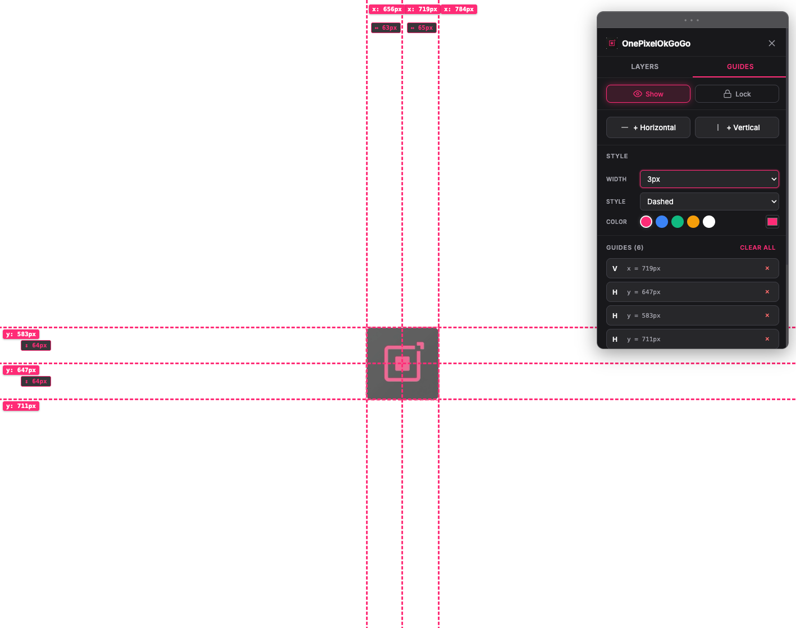
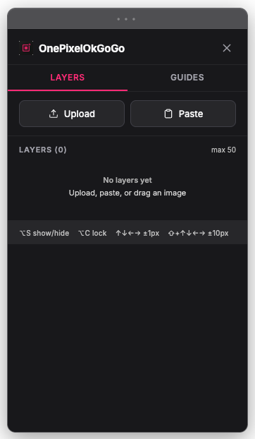
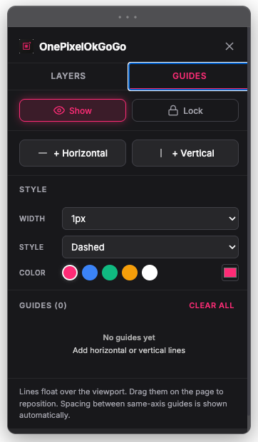
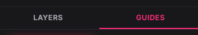
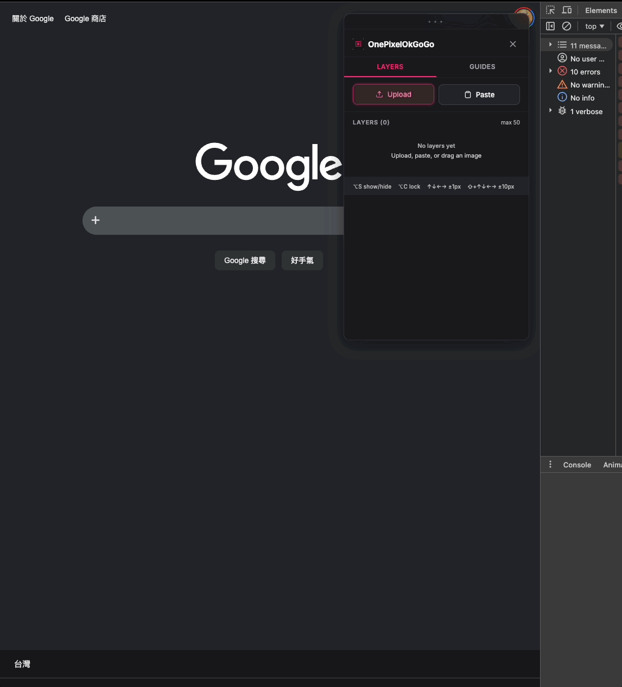

# OnePixelOkGoGo

> one-pixel-ok-gogo overlay & smart guides — right inside your browser.

[English](docs/README-en.md) · [繁體中文](docs/README-zh-TW.md) · [日本語](docs/README-ja.md) · [Français](docs/README-fr.md)

# OnePixelOkGoGo

> **one-pixel-ok-gogo overlay & smart guides — right inside your browser.**
>
> Overlay your design mock on the live page, nudge it pixel-by-pixel until it matches. Never again toggle between Figma and Chrome.

<!-- Screenshot: popup open, page with overlay layer + two guides showing spacing -->

---

## Why?

You know the drill — designer says "2px off", "spacing's wrong", "font slipped a bit."
This extension lets you **overlay the design mock directly on the live page**, then nudge it pixel-by-pixel until it matches.

| Pain | Fix |
|------|-----|
| Tab-toggling between Figma and Chrome | **Semi-transparent layers right on the page** |
| Spacing isn't a multiple of 8? | **Drop two guides, auto spacing label** |
| Aligning multiple regions | **Multiple layers, independently show/lock** |
| Adjusting takes too many clicks | **1px / 10px arrow-key nudges** |

## Features

### 1. Layers — overlay design mocks

- Upload / paste / drag-drop image files (up to 50)
- Live opacity, scale, X/Y inputs
- **5-direction snap**: top / bottom / left / right / center to current viewport
- **Drag + arrow-key** nudging (1px or Shift+10px)
- Per-layer **show / lock / delete**

### 2. Guides — measure spacing

- Add **horizontal or vertical** guide lines with one click
- **Drag** them anywhere on the viewport
- **Auto spacing label** between same-axis guides
- Global style: width / style (dashed / solid / dotted / double) / color
- **Show / Lock** toggle to prevent accidents

### 3. Floating panel

- **Draggable injected sidebar**
- Two tabs: **Layers** & **Guides**
- Move it out of the way anytime

## Shortcuts

| Key | Action |
|-----|--------|
| **⌥⌘S / Alt+Ctrl+S** (Guides tab) | Toggle guides visibility |
| **⌥⌘C / Alt+Ctrl+C** (Guides tab) | Toggle guides lock |
| **⌥S / Alt+S** | Toggle current layer visibility |
| **⌥C / Alt+C** | Toggle current layer lock |
| **↑ ↓ ← →** | Move layer 1px |
| **Shift + ↑↓←→** | Move layer 10px |

## Install

> Available on Chrome Web Store — install instantly:

[**OnePixelOkGoGo — Chrome Web Store**](https://chromewebstore.google.com/detail/onepixelokgogo/mgojihpngfjnhidaeoeedjbkcegddcdc)

Or load as unpacked extension:

1. Download / clone this repo
2. Open Chrome → `chrome://extensions`
3. Toggle **Developer mode** (top-right)
4. Click **Load unpacked** → select the project folder
5. Pin the icon to your toolbar

## Quick Start

1. Click the **OnePixelOkGoGo icon** — floating panel appears
2. In **Layers** tab, paste / drop the design mock
3. Set opacity to 50%, use ↑↓←→ to align with the page
4. Switch to **Guides** tab, hit "+ Horizontal", drag to where you want
5. Add another — **spacing between them is shown automatically**

## Who's it for

- **Frontend devs** — one-pixel-ok-gogo implementation, locale alignment, responsive QA
- **UI/UX designers** — visual QA against the design spec
- **QA engineers** — screenshot diffing, visual regression repro
- **Content editors** — verify layout & margins

## Roadmap

- [ ] Guide groups (named, switchable)
- [ ] Import / export guide presets
- [ ] Lock layer aspect ratio
- [ ] Snap-to-guide alignment
- [x] Chrome Web Store release

## Support / Donate

If this saved you time, a coffee keeps it alive 🙏

## Feedback

Issues / PRs / DMs welcome.

---

[← Back to main README](README.md)